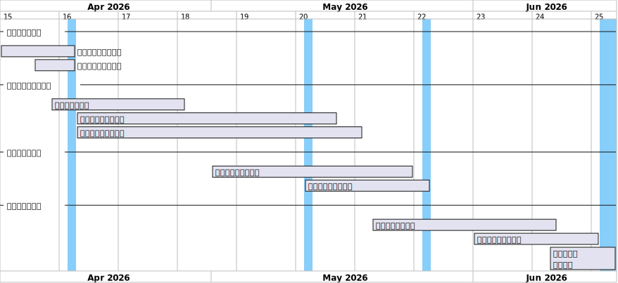
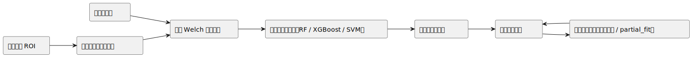
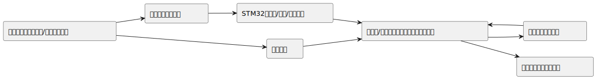
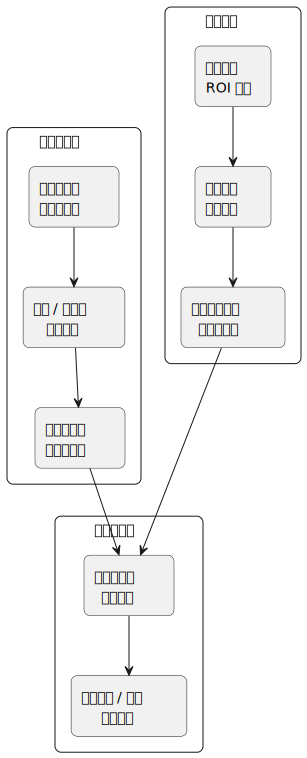
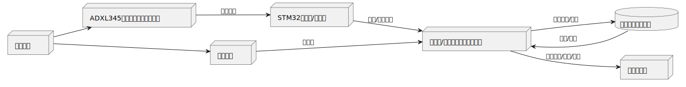

# 开题报告

## 1. 选题介绍

本课题面向机械设备运行状态监测这一典型工业问题。旋转机械、机床、发动机、轴承等设备在长期运行过程中会因不平衡、松动、磨损、润滑不足或工况变化产生振动特征变化。若不能及时识别异常，容易造成非计划停机、维护成本上升、生产中断，甚至安全事故。因此，围绕振动信息开展设备运行状态识别，是预测性维护和智能运维中的核心问题之一[1][2]。

现有工程实践中，设备状态监测主要依赖接触式振动传感器，如加速度计、速度传感器等。这类方法成熟、可靠，但也存在现实约束：一是传感器安装和布线成本较高，二是测点数量有限、空间覆盖不足，三是在高温、狭小、危险或不便接触的场景下部署受限，四是在新增工况或新增设备时，模型往往需要重新采集和训练[1][3]。因此，探索兼顾可靠性、灵活性和可扩展性的双测点监测方案，具有明确的工程价值。

基于此，本课题拟采用“三轴振动传感器 + 全局相机”的双测点方案。其基本思路是：利用三轴振动传感器获取稳定、成熟的接触式振动信号，同时利用全局相机对设备局部区域进行非接触视觉测振，提取位移时序、频谱主峰、频带能量等特征；进一步通过特征融合实现设备运行状态识别，并探索在新增少量工况样本下的增量更新能力。该方案并非试图替代传统振动监测，而是在保留接触式方案可靠性的基础上，引入视觉测振提高测点灵活性、可解释性和部署适应性。

### 1.1 国内外研究现状

国外在机械状态监测与预测性维护方面研究较早，已经形成较为成熟的“振动传感器 + 信号处理 + 智能诊断”研究框架。相关综述指出，振动分析仍然是状态监测中最有效、最常用的手段之一，但工业应用中仍面临测点布置、成本、数据质量和模型泛化等问题[1][2][3]。在视觉测振方向，国际研究已从早期的视频运动放大发展到基于相位、视觉测振和非接触振动测量等方法，能够从视频中恢复微小振动并估计特征频率[4][5][6][7]。近年的研究开始进一步将视觉方法直接用于旋转机械非接触状态监测，表明视觉方法在机械场景中的应用正从“算法验证”走向“监测应用”[8]。

国内研究近年也在快速推进，但整体上更集中于两类方向：一类是基于振动信号的传统故障诊断与智能诊断，尤其在轴承、转子、机电系统等对象上积累较多；另一类是基于计算机视觉的非接触振动/位移测量，主要集中在土木结构、振动台试验、铁路与大型结构监测等场景[9][10]。这说明国内在“视觉非接触测振”方面已经具备较好的技术基础，但将其与机械设备状态监测、双模态融合以及增量学习结合起来的研究仍相对不足。另一方面，国内外关于增量学习在故障诊断中的研究正在增加，尤其针对工况变化、少样本新故障、类别持续扩展等问题，已出现一批面向轴承故障诊断的增量学习方法[11][12][13]。不过，这些工作大多仍以单一振动信号为主，对“视觉 + 传感器”双模态条件下的增量更新研究还不充分。

### 1.2 课题切入点与实用性

总体来看，现有研究已经分别证明了三件事：第一，接触式振动监测对机械故障识别是有效的；第二，视觉测振可以作为非接触方式提取微小振动信息；第三，增量学习有望缓解工业现场新工况和新故障样本不足的问题。然而，将三轴振动传感器与全局相机结合，面向机械设备运行状态监测构建双测点融合方案，并进一步考虑小样本增量更新，仍然具有明显的研究空间和应用意义。

本课题的实用性主要体现在三个方面。第一，在工程部署层面，双测点方案兼顾了接触式振动监测的稳定性与视觉测振的非接触优势，适合面向复杂、受限或需要快速部署的机械场景。第二，在识别层面，多模态特征融合有望提高对不同工况、不同异常形式的鲁棒性，减少单一测点失效带来的影响。第三，在运维层面，增量学习可以更贴近现场需求，在新增少量样本时实现快速更新，而不是每次完全从头训练。因此，本课题不仅具有算法研究价值，也具有明确的工程应用背景，适合作为机械设备智能监测方向的开题选题。

## 2. 研究计划

本课题周期集中在 2026 年 4 月至 6 月，整体安排遵循“前期调研与方案收敛、中期实现与验证、后期集成与汇报”的节奏。关键节点如下：4 月 6 日确定方向并开始调研，4 月 14 日完成开题报告，5 月 12 日进行中期讨论，5 月 26 日进行中期展示，6 月 16 日参加结题研讨会，6 月 17 日完成结题汇报。

### 2.1 阶段性安排

| 阶段 | 时间 | 主要任务 | 阶段产出 |
| --- | --- | --- | --- |
| 前期调研与开题 | 4.06 - 4.14 | 明确研究方向、完成文献调研、收敛技术路线 | 开题报告、初步系统方案 |
| 方案设计与基础实现 | 4.15 - 5.12 | 完成双测点链路设计、硬件选型、视觉算法原型与数据采集方案 | 原型代码、采集方案、阶段数据 |
| 中期实现与验证 | 5.01 - 5.26 | 建立基线模型、完成阶段性实验、整理中期材料 | 中期展示、实验结果 |
| 后期集成与完善 | 5.20 - 6.17 | 增量更新验证、系统联调、结果分析、结题材料整理 | 结题报告、答辩 PPT、演示系统 |

## 3. 研究目标及预期成果

### 3.1 研究目标

围绕机械设备状态监测场景，本课题拟解决以下三个核心问题：

1. 在受限或不便接触的场景下，如何利用全局相机稳定提取设备局部振动特征，并与传感器测得的振动信息形成互补。
2. 在样本规模有限、工况变化存在的条件下，如何构建适用于课程项目范围的双模态特征融合状态识别方法。
3. 当系统后续加入少量新工况样本时，如何在不完全重训的前提下实现轻量级增量更新。

### 3.2 预期成果

| 目标 | 对应成果 |
| --- | --- |
| 构建双测点监测链路 | 完成“三轴传感器 + 全局相机”采集与同步分析原型 |
| 建立视觉测振主链路 | 输出 ROI 角点轨迹、中位数位移时序及滑窗主频、功率、频谱质心、频谱熵等视觉特征 |
| 实现状态识别模型 | 完成单模态基线与双模态融合分类实验 |
| 验证增量更新能力 | 基于少量新样本完成原型更新或轻量在线更新演示 |
| 完成课程交付 | 形成开题、中期、结题材料及可演示系统 |

### 3.3 差异点与研究价值

与单一传感器故障诊断方案相比，本课题的差异点不在于单纯替换测量手段，而在于以工程应用为导向，将非接触视觉测振纳入传统振动监测体系，形成双测点协同感知；同时考虑小样本新增工况下的模型更新问题，使方案更贴近真实设备运维场景。研究价值体现在“可部署性、可扩展性、可解释性”三个维度。

## 4. 研究思路一：机器学习与增量学习算法路线

本部分聚焦“如何从多源振动数据中得到可用于分类和增量更新的模型表示”。整体思路是先建立稳定、可解释的特征工程与基线分类链路，再在此基础上引入轻量级增量更新机制，而不是直接采用复杂深度模型。当前视觉侧核心算法已经明确收敛为“ROI 角点跟踪 + 位移时序重建 + 滑窗 Welch 频谱特征”，这一路线既符合课程周期约束，也便于在答辩中说明输入、处理中间量与最终特征之间的对应关系。

### 4.1 算法层核心步骤

1. 对传感器侧信号进行去直流、滤波、频谱估计和统计特征提取。
2. 对视觉侧视频选取稳定 ROI，并在 ROI 内提取 Shi-Tomasi 角点。
3. 使用 Lucas-Kanade 光流跟踪角点位移，得到多点位移轨迹，并通过中位数聚合形成稳健位移时序。
4. 对位移时序按统一时间窗口进行 Welch 频谱分析，提取主频、峰值功率、频谱质心、频谱熵等窗口级特征。
5. 将视觉与传感器特征按照统一时间窗口组织成结构化样本，建立单模态基线模型与双模态融合分类器。
6. 设计增量更新机制，在新增少量样本时更新模型或类别原型。

### 4.2 该部分希望体现的创新点

1. 视觉侧采用“角点群体跟踪 + 中位数位移重建”的稳健方案，而不是单点跟踪或仅凭主观可视化判断振动。
2. 以滑窗 Welch 频谱特征为核心，形成可解释、可结构化的视觉特征表，而不是完全依赖黑盒模型。
3. 将视觉与传感器特征按统一时间窗口对齐后进行融合，突出“双测点互补”而不是“双通道堆叠”。
4. 在课程项目范围内引入轻量级增量更新，体现工程可扩展性。

## 5. 研究思路二：系统工程上的软件 + 硬件 + 数据路线

本部分聚焦“如何把算法路线落到真实可运行的课程项目系统中”。系统工程路线以硬件采集、数据同步、软件处理、模型训练和结果展示为主线，强调从设备、传感器、相机、嵌入式控制板到上位机算法的完整闭环。

### 5.1 系统工程层主线

1. 搭建机械实验对象与传感器、相机采集环境。
2. 由 STM32 完成底层采集、控制与接口管理。
3. 由香橙派或上位机完成视频分析、信号处理、模型训练和结果存储。
4. 建立带时间窗口与标签的样本管理机制，支撑后续融合训练。
5. 通过前后端界面或演示页面展示状态识别结果与实验过程。

### 5.2 该部分希望体现的创新点

1. 不是只做算法离线验证，而是从采集到展示构成完整课程系统。
2. 把双测点同步、数据组织和模型更新纳入统一工程框架。
3. 兼顾硬件实现、软件流程和后续扩展空间，使系统更具有交付性。

## 6. 拟采取方案一：算法实现方案与关键技术

算法实现上，课题采用“先稳健提取位移时序，再做窗口级频谱特征建模，最后进行融合识别与增量更新”的路径。视觉侧主链路已经收敛为：先在 ROI 内提取 Shi-Tomasi 角点，再利用 Lucas-Kanade 光流跟踪角点位移，之后对多点位移轨迹取中位数并去趋势，形成稳健位移时序；最后按统一窗口做 Welch 频谱分析，输出主频、峰值功率、频谱质心、频谱熵等结构化特征。运动放大仅作为辅助可视化工具；传感器侧以三轴振动信号的时域、频域特征为主；分类部分优先采用 Random Forest、XGBoost 或 SVM 等对小样本更友好的模型；增量更新部分优先采用原型更新或支持 partial_fit 的轻量模型。

### 6.1 关键技术点

| 模块 | 关键技术 |
| --- | --- |
| 视觉测振 | ROI 选择、Shi-Tomasi 角点提取、Lucas-Kanade 光流跟踪、中位数位移重建、滑窗 Welch 频谱分析 |
| 传感器测振 | 三轴采样、滤波、时域统计、频域特征提取 |
| 融合识别 | 统一窗口对齐、结构化特征表构建、特征拼接、传统机器学习分类 |
| 增量更新 | 类中心更新、少样本补充、轻量在线更新 |

## 7. 拟采取方案二：系统实现方案与关键技术

系统实现上，拟采用“机械对象 + 传感器 + 相机 + STM32 + 香橙派/上位机”的分层架构。传感器负责稳定测振，全局相机负责非接触观测，STM32 负责驱动、采样与接口控制，上位机负责算法处理、样本管理和结果展示。答辩阶段重点展示完整的数据流和系统闭环，而不只展示单点算法结果。

### 7.1 系统落地重点

1. 明确双测点的数据采样接口与同步方式。
2. 保证传感器链路与视觉链路均能输出统一时间窗口的特征数据。
3. 预留前后端展示接口，支撑中期和结题答辩演示。

## 8. 可行性分析

### 8.1 技术可行性

| 维度 | 可行性说明 | 当前风险 | 应对措施 |
| --- | --- | --- | --- |
| 视觉测振 | 已形成“角点跟踪 - 位移重建 - 滑窗 Welch 特征”主链，算法结构清晰且便于输出结构化特征 | 受光照、纹理、帧率与光流漂移影响较大 | 选取稳定 ROI，保证充足纹理与照明，记录真实采样帧率，并通过多点统计与窗口分析减弱异常轨迹影响 |
| 传感器测振 | 三轴加速度传感器方案成熟，采集链路易于搭建 | 小振幅下信噪比不足，平台倾斜会引入重力分量干扰 | 选用合适量程与分辨率传感器，加强结构固定与滤波处理 |
| 融合识别 | 特征工程 + 传统机器学习适合小样本课程项目 | 双模态同步和标签管理复杂 | 采用统一时间窗口和样本编号管理 |
| 增量更新 | 原型更新和轻量在线学习实现门槛较低 | 新工况样本过少时容易不稳定 | 先做演示级验证，再控制工况范围 |

### 8.2 资源可行性

项目所需资源主要包括机械实验对象、三轴加速度传感器、全局相机、STM32、香橙派或上位机，以及常规的软件开发环境。当前方案采用成熟硬件与开源算法库，资源获取难度较低，适合在课程周期内完成原型验证。软件侧已有视觉测振原型基础，后续工作重点在于补上传感器支路、融合训练和系统联调。

### 8.3 时间可行性

从时间安排看，课题采用分阶段推进方式，前期以调研和方案收敛为主，中期完成原型实现与阶段验证，后期再集中做联调、增量更新和材料整理。技术路线优先采用可解释、实现成本低的传统机器学习与轻量增量学习方案，避免在课程周期内引入实现风险过高的复杂深度模型，因此整体时间上可控。

### 8.4 分工安排

| 姓名 | 负责内容 |
| --- | --- |
| 杨炫志 | 模型训练 |
| 甘芸瑄 | 硬件实现与实验搭建 |
| 冶秉礼 | 与老师对接、后端驱动、摄像头数据采集 |
| 贺鑫皓 | 前后端开发 |
| 杨喆 | 硬件实现与实验搭建 |
| 张展硕 | 视觉数据处理 |
| 张嘉欣 | 文档撰写、测试 |

## 9. 关键创新点

### 9.1 创新点概括

1. 提出面向机械设备状态监测的“双测点融合”方案，将接触式传感器与非接触视觉测振结合起来。
2. 视觉侧不以运动放大为主，而是采用“角点群体跟踪 + 中位数位移重建 + 滑窗 Welch 特征”的可量化主链。
3. 将视觉窗口特征表与传感器窗口特征表统一对齐，形成便于融合分类与后续扩展的结构化样本。
4. 在课程项目范围内引入小样本增量更新机制，使系统具备新增工况快速适配能力。
5. 从采集、同步、建模到展示构建完整系统，而不是停留在离线算法验证层面。

### 9.2 创新点结构示意

## 10. 当前仍欠缺的内容与后续补充重点

为保证开题报告与开题答辩内容“账面上说得过去”且后续能真正落地，目前仍欠缺以下几类关键内容：

1. 缺少明确的实验对象定义。目前文档中提到齿轮箱模型，但实验对象、工况类型、状态类别数量还没有完全固定，需要尽快统一口径。
2. 缺少传感器支路的实测数据与采集参数。视觉支路已有原型和公开样例验证，但传感器采样频率、接口方案、同步方式还需要明确。
3. 缺少融合数据组织方案的实例。虽然已经有统一窗口特征的想法，但开题答辩中最好给出一张样本结构示意图或样例表，说明双模态如何对齐。
4. 缺少增量学习部分的评价口径。需要提前定义“新增工况”“少量样本”的范围，以及更新前后用什么指标比较。
5. 缺少系统展示方案的页面草图或演示流程。答辩时如果只讲算法，系统完整性会显得偏弱，建议补一个前后端或结果展示界面的示意图。
6. 缺少预算页内容。虽然本轮可暂缓，但 PPT 最终仍需要至少给出硬件清单、单价估算和总预算范围。

## 11. 参考文献

[1] Ietezaz Ul Hassan, Krishna Panduru, Joseph Walsh. An In-Depth Study of Vibration Sensors for Condition Monitoring. Sensors, 2024. DOI: 10.3390/s24030740.

[2] D. Goyal, B. S. Pabla. Condition based maintenance of machine tools: A review. CIRP Journal of Manufacturing Science and Technology, 2015. DOI: 10.1016/j.cirpj.2015.05.004.

[3] N. Ismail, K. Chatterton, A. Pennacchi, et al. Non-contact sensor placement strategy for condition monitoring of rotating machine-elements. Engineering Science and Technology, an International Journal, 2019. DOI: 10.1016/j.jestch.2018.12.006.

[4] Neal Wadhwa, Michael Rubinstein, Fredo Durand, William T. Freeman. Phase-Based Video Motion Processing. ACM Transactions on Graphics, 2013. DOI: 10.1145/2461912.2461966.

[5] Abe Davis, Michael Rubinstein, Neal Wadhwa, et al. Visual Vibrometry: Estimating Material Properties from Small Motions in Video. IEEE Transactions on Pattern Analysis and Machine Intelligence, 2017. DOI: 10.1109/TPAMI.2016.2622271.

[6] Modal analysis of machine tools using visual vibrometry and output-only methods. CIRP Annals, 2020. DOI: 10.1016/j.cirp.2020.04.043.

[7] A novel phase-based video motion magnification method for non-contact measurement of micro-amplitude vibration. Mechanical Systems and Signal Processing, 2024. DOI: 10.1016/j.ymssp.2024.111429.

[8] Seo Hyeon Jeong, Yeseul Kong, Seunghwan Lee, Gyuhae Park. Non-contact condition monitoring of rotating machinery via phase-synchronized stroboscopic imaging. Structural Health Monitoring, 2026. DOI: 10.1177/14759217251410493.

[9] 冯海龙, 刘伯奇, 胡海天, 等. 基于视觉测振技术的高铁无站台柱雨棚振动测量方法. 地震工程与工程动力学, 2022. DOI: 10.13197/j.eeed.2022.0322.

[10] 韩建平, 张一恒, 张宏宇. 基于计算机视觉的振动台试验结构模型位移测量. 地震工程与工程振动, 2019. DOI: 10.13197/j.eeev.2019.04.22.hanjp.003.

[11] Junhui Zheng, Hui Xiong, Yuchang Zhang, et al. Bearing Fault Diagnosis via Incremental Learning Based on the Repeated Replay Using Memory Indexing Method. Machines, 2022. DOI: 10.3390/machines10050338.

[12] Bearing fault diagnosis under various conditions using an incremental learning-based multi-task shared classifier. Knowledge-Based Systems, 2023. DOI: 10.1016/j.knosys.2023.110395.

[13] Rui Yang, Pengfei Zhang, Zhirui Kai, et al. Few-shot class-incremental fault diagnosis of bearings via pseudo-incremental learning and dual-model complementarity. Proceedings of the IMechE, Part C, 2026. DOI: 10.1177/09544062251413635.

